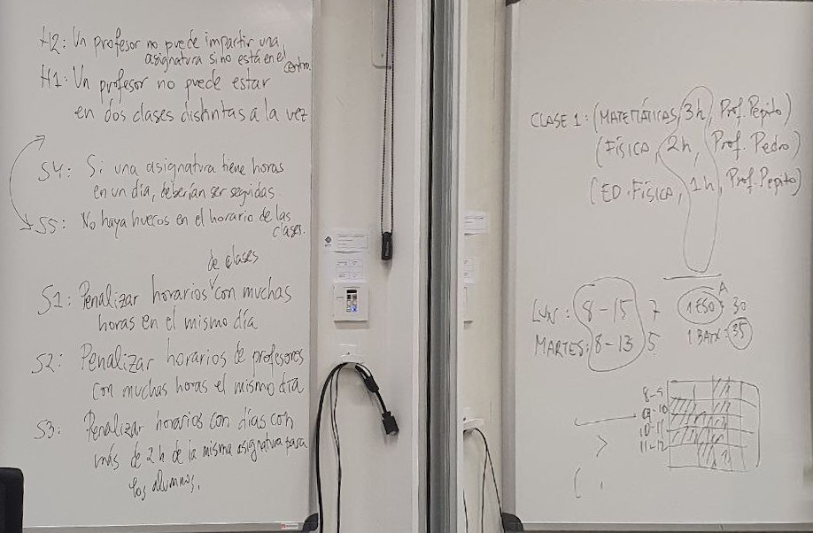

# Evolutive-scheduling

Solving a scheduling problem using evolutive algorithms

El algoritmo tendrá como entrada la siguiente
información:

* Un número de clases (grupos de alumnos). Ningún alumno está en dos clases.

* Para cada clase, un número total de horas semanales y una lista de asignaturas.
Cada asignatura tendrá un número de horas semanales establecido y un profesor
asignado. Tened en cuenta que un profesor puede dar asignaturas en varias
clases distintas y varias asignaturas a la misma clase.

* Para cada profesor, se dispondrá de su disponibilidad horaria, puede ser que no
esté disponible en determinadas horas de la semana.

* Las franjas horarias semanales disponibles para impartir las clases. (del centro)




# Hard ruleset

1. Un profesor no puede estar en dos aulas distintas a la vez. Esta es ignorable si en nuestra representación, población, y operador de mutación lo tenemos en cuenta.

2. Un profesor no puede impartir la asignatura, si no está en el centro.

3. Dos asignaturas del mismo curso no pueden coincidir en el tiempo (solaparse).


# Soft ruleset

1. Penalizar los horarios de cursos con muchas horas en el mismo día (> 8 horas).

2. Penalizar los horarios de profesores con muchas horas en el mismo día.

3. Penalizar los horarios de cursos que tengan asignaturas con más de 2 horas de docencia de la misma asignatura por día.

4. Penalizar los horarios de curso que tengan mas de dos horas la misma asignatura (curso)

5. Penalizar los horarios de cursos en los que una misma asignatura se imparte de forma no consecutiva en el mismo día.

6. Penalizar los horarios de cursos que tengan huecos. ¡Esta condición está entre hard y soft!.

7. Penalizar los horarios de profesores que tengan huecos.

8. Penalizar los horarios de profesores con horas vacías al principio del día. Es decir promover que las horas vacías estén al final del día.


## Estrcutras de datos

### Profesor
Número entero

### Clase
Número entero

### TimeSlot
Número entero, entre 0 y 23 (representando las horas del dia>)


### Número de clases
Un numero de clases arbitrario (10)

### Materia
Número entero (23)

### Disponibilidad del profesor
Array de 7 posiciones donde la posicion 0 representa Lunes y el 6 representa el Domingo
```json
// Sin disponibilidad
[ [], [], [], [], [], [] ,[] ]
```
```json
// Disponibilidad los Miercoles durante las 10, 11 y las 14 del mediodia
[ [], [], [10, 11, 14], [], [], [] ,[] ]
```

### Clases
Vienen dadas por un grupo de materias y un número total de horas semanales
```json
{
  idClase: 1,
  totalHorasSemanales: 12,
  listaAsignaturas: [1, 3, 4]
}
``` 
### Asignatura
```json
{
  idAsignatura: 1,
  totalHorasSemanales: 12,
  profesor: 1
}
```
