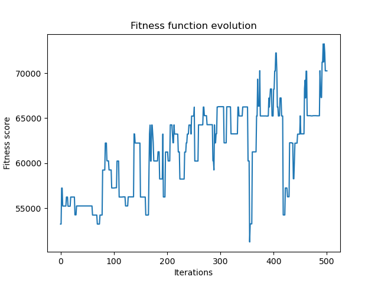
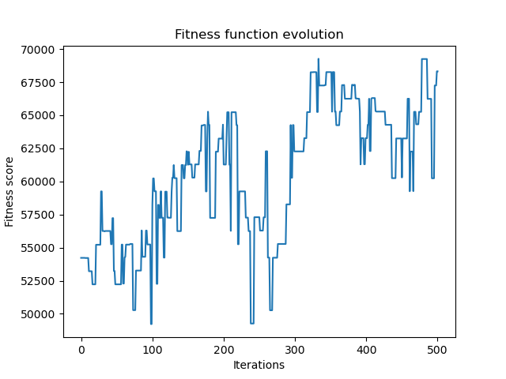
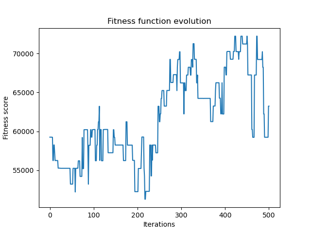
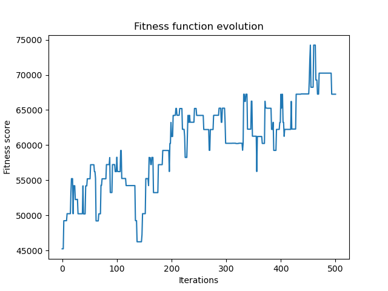

# Generación de horarios

<div align="center">

  [Visualizar video antes de realizar las pruebas ](video/demo.mp4)

</div>

## Ejecutando la solución

### Para generar los horarios:

Python >= 3.7.0 para las dependencias ojear requirements.txt

```bash
make run  # ejecutara el algoritmo para los inputs dentro de inputs/test{1,2}
# ejecutara el algoritmo para los inputs dentro de inputs/test3
# Puedes añadir tus inputs y modificar la receta de make run-once
make run-once  
```

**Nota** Los horarios y pantallazos generados se almacenarán dentro del directorio outputs/test{id}


### Para visualizar los horarios
NodeJS >= 14.0.0

```bash
make start-visor # Y abrir http://localhost:4200/ en un navegador web
```


## Identificación

Asignatura: 11753 Inteligencia Computacional

Estudios: MUSI - UIB - Curso 21/22

Profesor: Dr. Sebastián Massanet Massanet
(s.massanet@uib.es)

Alumnos: 
- Natalia Cardona Matamoros
(erika-natalia.cardona1@estudiant.uib.cat)
- Miquel Àngel Roman Colom 
(miquel-angel.roman1@estudiant.uib.cat)
- Lluís Bernat Ladaria 
(lluis.bernat2@estudiant.uib.cat)

## Enunciado 

El objetivo de esta entrega 
es implementar un algoritmo evolutivo 
para la elaboración de horarios 
en un centro educativo. 
El algoritmo tendrá como entrada la siguiente
información:

- Un número de clases (grupos de alumnos). 
Ningún alumno está en dos clases.
- Para cada clase, 
un número total de horas semanales 
y una lista de asignaturas.
Cada asignatura tendrá un número 
de horas semanales establecido y un profesor asignado. 
*Tened en cuenta que un profesor puede dar asignaturas en varias
clases distintas y varias asignaturas a la misma clase*.
- Para cada profesor se dispondrá de su disponibilidad horaria, 
puede ser que no esté disponible en determinadas horas de la semana.
- Las franjas horarias semanales disponibles para impartir las clases.

La salida del algoritmo será el horario semanal de cada clase. Supondremos que el centro establece una aula fija 
para cada clase de manera que el algoritmo no tiene que asignar aulas.
1. Estableced cuáles son las restricciones *soft* y *hard* de vuestro algoritmo y justificadlas.
1. Explicad claramente cuál es la codificación usada, cuáles son los parámetros del algoritmo y su función de *fitness*. 
Justificad su elección.
1. Cread varias entradas con distintos grados de dificultad 
y analizad los resultados obtenidos. 
Podéis utilizar como entrada listas de asignaturas y sus horas
semanales de distintos cursos de secundaria y bachillerato.
1. Proponed alguna modificación al algoritmo 
y analizad los resultados obtenidos.
Esta modificación puede ser un nuevo operador de mutación 
o recombinación, 
una nueva estrategia de selección de los individuos de la nueva generación, etc.

Podéis implementar los algoritmos 
en el lenguaje que consideréis más adecuado. 
Los algoritmos tienen que ir acompañados de:
1. Todos los ficheros fuente.
1. En la memoria se tiene que explicar brevemente 
cada función implementada.


## Introducción

En este trabajo vamos a desarrollar un algoritmo evolutivo 
en lenguaje *Python* 
para la confección de horarios siguiendo 
las pautas del [enunciado](#Enunciado). 
Para dar cuenta de ello se divide este trabajo 
en los siguientes apartados:
- [Restricciones](#Restricciones): se detallan 
el conjunto de restricciones fuertes 
(i.e. las que una solución válida debe cumplir) 
y el conjunto de restricciones débiles 
(i.e. todas las que una solución debe intentar cumplir).
- [Implementación](#Implementación): en este 
apartado se presenta el formato 
de las entradas al proceso, 
el genotipo, la representación interna de ambos, 
el método de población inicial, 
la función de *fitness*, 
y los diferentes operadores 
(mutación, recombinación y selección).
- [Pruebas y análisis](#Pruebas-y-análisis): donde 
se analizan los resultados obtenidos para diferentes 
ejemplos que se suministran.
- [Cambios y resultados](#Cambios-y-resultados): en 
este apartado se describen los dos metodos implementados y se presentan sus resultados.

- [Ejemplos de horarios generados](#Ejemplos-de-horarios-generados): finalmente
adjuntamos unos volcados de pantalla de algunos horarios.


## Restricciones

Consideraremos dos conjuntos de restricciones. 

### Conjunto de restricciones *hard*

Consideramos tres restricciones fuertes:

1. Un profesor no puede estar en dos aulas distintas a la vez. Esta es ignorable si en nuestra representación, población, y operador de mutación lo tenemos en cuenta.

1. Un profesor no puede impartir la asignatura, si no está en el centro.


1. Dos asignaturas del mismo curso no pueden coincidir en el tiempo (solaparse).

Las dos primeras restricciones las cumpliremos teniéndolas en cuenta en la representación del genotipo y en los operadores.

La última restricción la penalizamos en una función de evaluacion a la que asignamos un peso alto.  

### Conjunto de restricciones *soft*

El conjunto de restricciones débiles es:

1. Penalizar los horarios de cursos con muchas horas en el mismo día (> 8 horas).

2. Penalizar los horarios de profesores con muchas horas en el mismo día.

3. Penalizar los horarios de cursos que tengan asignaturas con más de 2 horas de docencia de la misma asignatura por día.

4. Penalizar los horarios de curso que tengan mas de dos horas la misma asignatura (curso)

5. Penalizar los horarios de cursos en los que una misma asignatura se imparte de forma no consecutiva en el mismo día.

6. Penalizar los horarios de cursos que tengan huecos. 

7. Penalizar los horarios de profesores que tengan huecos.

8. Penalizar los horarios de profesores con horas vacías al principio del día. Es decir promover que las horas vacías estén al final del día.

Estas restricciones han sido tenidas en cuenta con la implementación de ocho funciones de evaluacion, con un peso más ligero.

## Implementación

### Entrada de datos

El conjunto de entrada de datos se ha implementado mediante ficheros JSON. 
Seguidamente detallamos su estructura con algunos ejemplos.


### Número de clases
Viene dado por la longitud del array dentro del fichero `clases.json`

### Asignatura
Tiene la siguiente estructura.

```json
{
"nombre": "Mates",
"idAsignatura": 1
}
```

### Disponibilidad del profesor
Array de 7 posiciones donde la posicion 0 representa lunes y el 6 representa el domingo
Aqui veremos un ejemplo de la disponibilidad semanal de un profesor. 

```json
[
  {
    "idProfesor": 1,
    "nombre": "Abie Abelson", 
    "disponibilidad": [
      [8,9,10,12,13,14,16,17],
      [8,9,10,12,13,14,16,17],
      [8,9,10,12,13,14,16,17],
      [8,9,10,12,13,14,16,17,18,19],
      [10, 11, 12],
      [],
      []
    ]
  }
]
```


### Horario del instituto

Esta definido dentro del fichero `Horario.json`

* Lista de horas en las que se va a dar clase.
* Falta el 11 para simular el patio
* Falta el 15 para simular hora de la comida
* El jueves es más _heavy_ para que el viernes sea más _light_
```json
[ 
  [8,9,10,12,13,14,16,17], 
  [8,9,10,12,13,14,16,17], 
  [8,9,10,12,13,14,16,17], 
  [8,9,10,12,13,14,16,17,18,19], 
  [10, 11, 12], 
  [] ,[] 
]
```
### Clases
Vienen dadas por un grupo de materias y un número total de horas semanales
```json
{
  "idClase": 1,
  "nombre": "3B",
  "totalHorasSemanales": 12
}
``` 
### Asignación
```json
{
  "idClase": 1,
  "horas": 3,
  "idAsignatura": 3,
  "idProfesor": 4
}
``` 
### Asignatura
```json
[
  {
    "idAsignatura": 1,
    "nombre": "Mates"
  },
  {
    "idAsignatura": 2,
    "nombre": "Física"
  }
]
```

### Genotipo

Nuestro genotipo será una estructura que puede 
concebirse como una tabla de dos dimensiones, donde:

- Las filas representan la *lista de tareas* de cada profesor. 
Es decir, existe una fila para cada profesor. 

- Las columnas representan cada una un *slot* horario. 
Todas las celdas de la misma columna representan el mismo *slot* temporal. 
Los *slots* tienen una duración de 60 minutos.

La implementación de este genotipo la haremos 
usando una tabla de *numpy*   cuya  ultima columna contiene 
el identificador del profesor y su contenido
es una lista de enteros. 
Por tanto la tabla poseerá P entradas 
y por tanto P filas, 
cada una con 168 posiciones (7 x 24), 
siendo P el cardinal del conjunto de profesores.
El primer *slot* de la fila se corresponde 
con la franja horaria 00:00 a 01:00 del lunes 
y el último con 
la franja horaria 23:00 a 24:00 del domingo.

Podemos pensar en esta estructura como una matriz 
de este estilo:

| IdProfesor | 0 | 1 | ... | 8 | 9 | 10 | 11 | ... | 167 |
| :---: | --- | --- | --- | --- | --- | --- | --- | --- | --- |
| 1 | ND | ND | ... | ND | 2 | 5 | 3 | ... | ND |
| 2 | ND | ND | ... | ND | 6 | Libre | 4 | ... | ND |
| ... | ... | ... | ... | ... | ... | ... | ... | ... | ND |
| 25 | ND | ND | ... | ND | ND | 7 | Libre | --- | ND |

En el ejemplo anterior:
- el profesor con `idProfesor` 1 tiene asignada:
    - la tarea con `idTarea` 2 el lunes a las 9
    - la tarea con `idTarea` 5 el lunes a las 10
    - la tarea con `idTarea` 3 el lunes a las 11
- el profesor con `idProfesor` 2 tiene asignada: 
    - la tarea con `idTarea` 6 el lunes a las 9
    - un *slot* libre el lunes a las 10
    - la tarea con `idTarea` 4 el lunes a la 11
- el profesor con `idProfesor` 25 tiene asignada:
    - la tarea con `idTarea` 7 el lunes a las 10
    - un *slot* libre el lunes a las 11

Los *slots* en los que el profesor no està disponible, 
están marcados con un valor especial que llamaremos *ND*.
Los *slots* en los que el profesor sí está disponible, 
pero no tienen ninguna tarea, se marcan con otro valor 
especial al que llamaremos *Libre*.

### Asignacion

Cada asignacion es un diccionario 
que consta de los siguientes campos: 

- `id`: entero que actua de clave única 
para esta entrada. 
Este valor se le asigna en el momento de su creación
en memoria de forma secuencial.
- `idClase`: entero que identifica 
de forma unívoca una clase de entre todas las definidas.
- `horas`: cantidad de *slots* temporales que, 
de forma obligatoria,
deben asignarse a esta tarea.
- `idAsignatura`: entero que identifica 
de forma unívoca la asignatura.
- `idProfesor`: entero que identifica de forma unívoca al profesor.


### Población inicial 

En la población inicial generamos un conjunto de genotipos, con el cardinal de la población. 
Donde tomamos como punto de inicio poblaciones de 30 y de 60 genotipos. 

### Función de *fitness*

En esta funcion evaluamos el conjunto de las once restricciones aunque las dos primeras 
son las restricciones *hard* que siempre se cumplen, por lo que tienen asignado un peso nulo.

```python
def _get_rules_vector(self) -> list:
    hard_weight = 1000  # Penaliza dos órdenes de magnitud más que una soft
    soft_weight = 10
    rules_duples = [
        [hard_weight, self._hard_rule1], # Cada regla viene implementada 
        [hard_weight, self._hard_rule2], # como una función de la clase Genotype
        [hard_weight, self._hard_rule3],
        [soft_weight, self._soft_rule1],
        [soft_weight, self._soft_rule2],
        [soft_weight, self._soft_rule3],
        [soft_weight, self._soft_rule4],
        [soft_weight, self._soft_rule5],
        [soft_weight, self._soft_rule6],
        [soft_weight, self._soft_rule7],
        [soft_weight, self._soft_rule8]
    ]

    return rules_duples
```


### Operador de selección

Elegimos los P genotipos instanciados con mayor puntuacion.


### Operador de mutación 

En el operador de mutacion realizamos permutaciones factibles con cierta probabilidad.

### Operador de recombinación

En el operador de recombinacion hemos implementado dos metodos: 
- Metodo 1: se ordenan los padres en base a su puntuacion antes de emparejarlos.
- Metodo 2: las parejas de padres son realizadas aleatoriamente.


## Pruebas y análisis

- Tamaño de poblacion

Cantidad de individuos diferentes que se reproduciran y mutaran.

- Metodos Crossover

Cruzando los mejores padre con las mejores madres y aleatorio.

- Probabilidad de mutacion

Hemos realizado pruebas con 1%,5%,10% y 50%.

- Numero de Iteraciones 

Hemos realizado pruebas con 5, 10, 100 y 500.

- Inputs(asignaturas,horarios,asignaciones,disponibilidad de profesores)

Suministramos 3 conjuntos de datos para las pruebas realizadas.


## Cambios y resultados


### Graficas del Metodo 1
Metodo 1: (Los padres se emparejan con aquellas madres de puntación más elevada)

#### Tamaño de poblacion = 30 individuos


#### Tamaño de poblacion = 60 individuos



### Graficas del Metodo 2
Metodo 2: (padres emparejados acordes a su puntuacion)

#### Tamaño de poblacion = 30 individuos


#### Tamaño de poblacion = 60 individuos



Podemos apreciar que los resultados convergen y los horarios generados son válidos ✅ 


## Ejemplos de horarios generados 


 